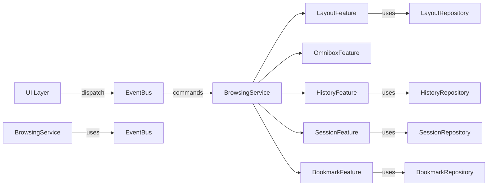
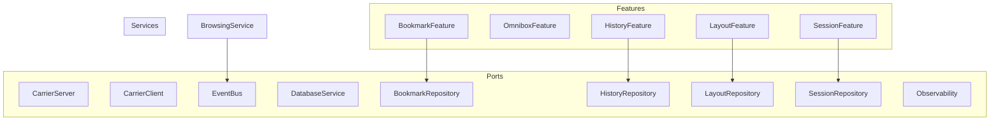

# Architecture Overview

> Auto-generated from code. Run `bun run docs:update` to refresh.

## Package Graph

```mermaid
graph TD
    ui_feature_workspace["ui.feature.workspace"]
    ui_feature_sidebar["ui.feature.sidebar"]
    domain_service_browsing["domain.service.browsing"]
    core_base_model["core.base.model"]
    domain_service_workspace["domain.service.workspace"]
    domain_adapter_otel["domain.adapter.otel"]
    ui_scene_main["ui.scene.main"]
    core_port_carrier["core.port.carrier"]
    core_port_event-bus["core.port.event-bus"]
    core_base_tracing["core.base.tracing"]
    domain_feature_layout["domain.feature.layout"]
    domain_adapter_db["domain.adapter.db"]
    domain_feature_omnibox["domain.feature.omnibox"]
    core_port_storage["core.port.storage"]
    domain_feature_history["domain.feature.history"]
    core_base_types["core.base.types"]
    core_ui_components["core.ui.components"]
    core_ui_design["core.ui.design"]
    core_port_otel["core.port.otel"]
    domain_runtime_bun["domain.runtime.bun"]
    domain_feature_session["domain.feature.session"]
    domain_runtime_webview["domain.runtime.webview"]
    domain_feature_bookmark["domain.feature.bookmark"]
    core_base_errors["core.base.errors"]
    domain_adapter_carrier["domain.adapter.carrier"]
    core_ui_api["core.ui.api"]

    ui_feature_workspace --> core_base_model
    ui_feature_workspace --> core_port_event-bus
    ui_feature_workspace --> core_ui_api
    ui_feature_sidebar --> core_base_model
    ui_feature_sidebar --> core_base_tracing
    ui_feature_sidebar --> core_base_types
    ui_feature_sidebar --> core_port_event-bus
    ui_feature_sidebar --> core_ui_components
    ui_feature_sidebar --> core_ui_api
    ui_feature_sidebar --> domain_feature_session
    domain_service_browsing --> core_base_errors
    domain_service_browsing --> core_base_model
    domain_service_browsing --> core_base_tracing
    domain_service_browsing --> core_base_types
    domain_service_browsing --> core_port_event-bus
    domain_service_browsing --> core_port_storage
    domain_service_browsing --> domain_feature_bookmark
    domain_service_browsing --> domain_feature_history
    domain_service_browsing --> domain_feature_layout
    domain_service_browsing --> domain_feature_omnibox
    domain_service_browsing --> domain_feature_session
    domain_service_workspace --> core_base_errors
    domain_service_workspace --> core_base_tracing
    domain_service_workspace --> core_port_storage
    domain_service_workspace --> domain_feature_layout
    ui_scene_main --> core_base_types
    ui_scene_main --> core_ui_components
    ui_scene_main --> ui_feature_sidebar
    ui_scene_main --> ui_feature_workspace
    core_port_event-bus --> core_base_errors
    core_port_event-bus --> core_base_model
    domain_feature_layout --> core_base_model
    domain_feature_layout --> core_base_tracing
    domain_feature_layout --> core_port_storage
    domain_adapter_db --> core_base_errors
    domain_adapter_db --> core_base_model
    domain_adapter_db --> core_base_tracing
    domain_adapter_db --> core_base_types
    domain_adapter_db --> core_port_storage
    domain_feature_omnibox --> core_base_tracing
    core_port_storage --> core_base_errors
    core_port_storage --> core_base_model
    core_port_storage --> core_base_tracing
    domain_feature_history --> core_base_errors
    domain_feature_history --> core_base_model
    domain_feature_history --> core_port_storage
    core_ui_components --> core_ui_design
    domain_runtime_bun --> domain_adapter_carrier
    domain_runtime_bun --> core_port_event-bus
    domain_runtime_bun --> core_port_storage
    domain_runtime_bun --> domain_adapter_db
    domain_runtime_bun --> domain_feature_bookmark
    domain_runtime_bun --> domain_feature_history
    domain_runtime_bun --> domain_feature_layout
    domain_runtime_bun --> domain_feature_omnibox
    domain_runtime_bun --> domain_feature_session
    domain_runtime_bun --> domain_service_browsing
    domain_runtime_bun --> domain_service_workspace
    domain_feature_session --> core_base_errors
    domain_feature_session --> core_base_model
    domain_feature_session --> core_base_tracing
    domain_feature_session --> core_base_types
    domain_feature_session --> core_port_storage
    domain_runtime_webview --> domain_adapter_carrier
    domain_feature_bookmark --> core_base_errors
    domain_feature_bookmark --> core_base_model
    domain_feature_bookmark --> core_port_storage
    core_ui_api --> core_port_event-bus
```

## Event Flow

## Layer Diagram (Hexagonal)

## Stats

- **26** packages
- **14** services
- **20** events/commands
- **11** layer edges
