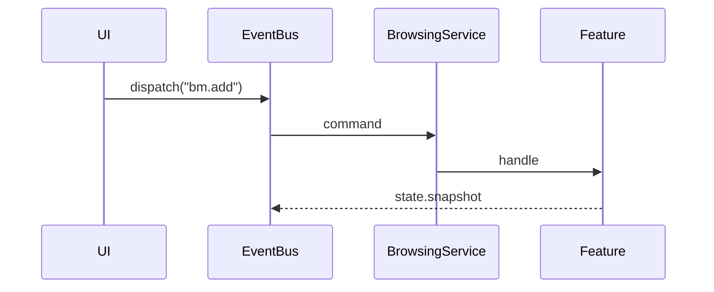

# bm.add

**Group:** bookmark
**Primary Key:** `(p) => p.url`
**Response:** Bookmark

## Payload

| Field | Type |
|-------|------|
| url | String |
| title | NullOr |

## Flow

```mermaid
sequenceDiagram
    UI->>EventBus: dispatch("bm.add")
    EventBus->>BrowsingService: command
    BrowsingService->>Feature: handle
    Feature-->>EventBus: state.snapshot
```
