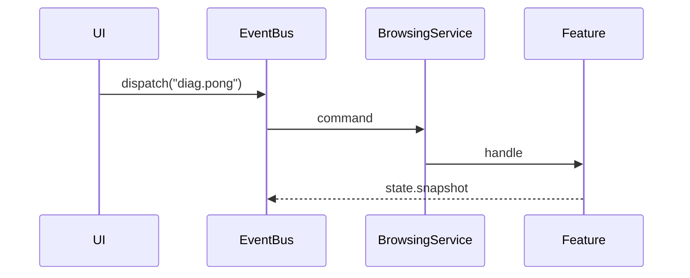

# diag.pong

**Group:** system
**Primary Key:** `() => "global"`
**Response:** void

## Payload

| Field | Type |
|-------|------|
| message | String |

## Flow

```mermaid
sequenceDiagram
    UI->>EventBus: dispatch("diag.pong")
    EventBus->>BrowsingService: command
    BrowsingService->>Feature: handle
    Feature-->>EventBus: state.snapshot
```
