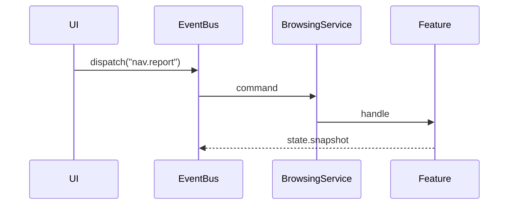

# nav.report

**Group:** navigation
**Primary Key:** `(p) => p.id`
**Response:** void

## Payload

| Field | Type |
|-------|------|
| id | String |
| url | String |

## Flow

```mermaid
sequenceDiagram
    UI->>EventBus: dispatch("nav.report")
    EventBus->>BrowsingService: command
    BrowsingService->>Feature: handle
    Feature-->>EventBus: state.snapshot
```
