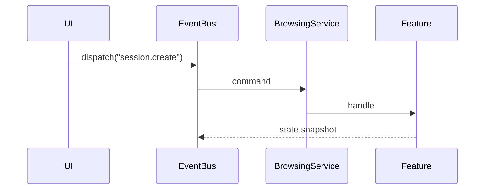

# session.create

**Group:** session
**Primary Key:** `() => "global"`
**Response:** Session

## Payload

| Field | Type |
|-------|------|
| mode | Literal |

## Flow

```mermaid
sequenceDiagram
    UI->>EventBus: dispatch("session.create")
    EventBus->>BrowsingService: command
    BrowsingService->>Feature: handle
    Feature-->>EventBus: state.snapshot
```
