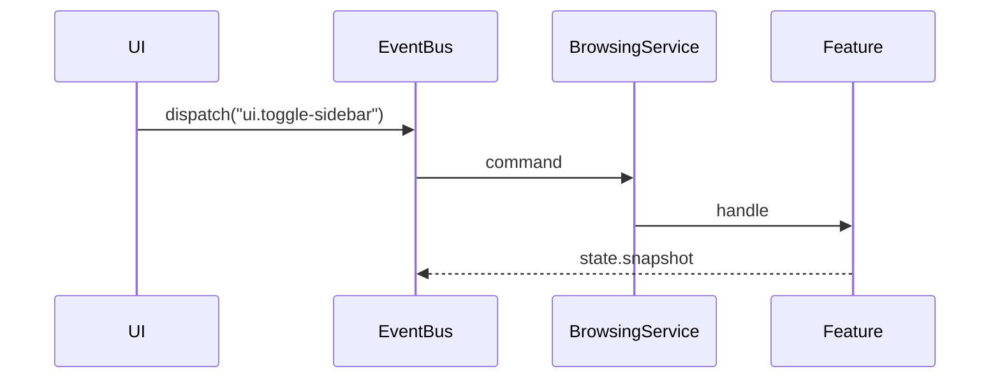

# ui.toggle-sidebar

**Group:** ui
**Primary Key:** `() => "global"`
**Response:** void

## Payload

| Field | Type |
|-------|------|
| — | — |

## Flow

```mermaid
sequenceDiagram
    UI->>EventBus: dispatch("ui.toggle-sidebar")
    EventBus->>BrowsingService: command
    BrowsingService->>Feature: handle
    Feature-->>EventBus: state.snapshot
```
