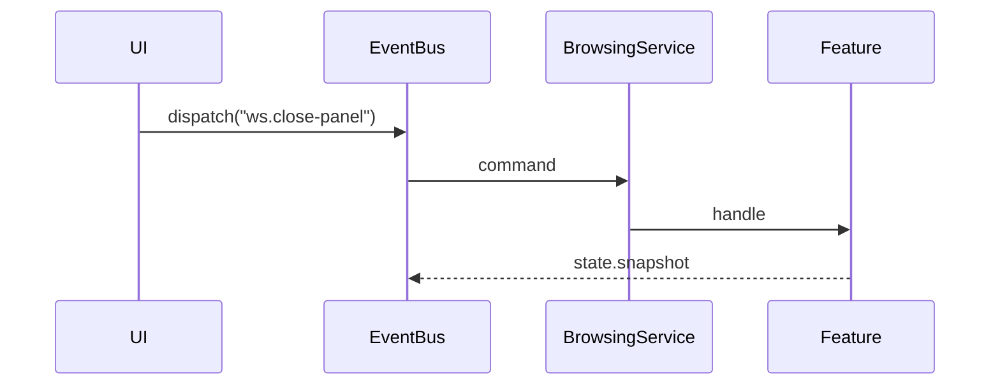

# ws.close-panel

**Group:** workspace
**Primary Key:** `(p) => p.panelId`
**Response:** void

## Payload

| Field | Type |
|-------|------|
| panelId | String |

## Flow

```mermaid
sequenceDiagram
    UI->>EventBus: dispatch("ws.close-panel")
    EventBus->>BrowsingService: command
    BrowsingService->>Feature: handle
    Feature-->>EventBus: state.snapshot
```
