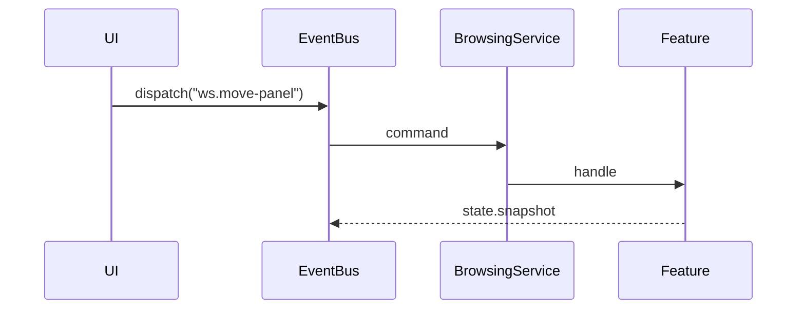

# ws.move-panel

**Group:** workspace
**Primary Key:** `(p) => p.panelId`
**Response:** void

## Payload

| Field | Type |
|-------|------|
| panelId | String |
| targetGroupId | String |

## Flow

