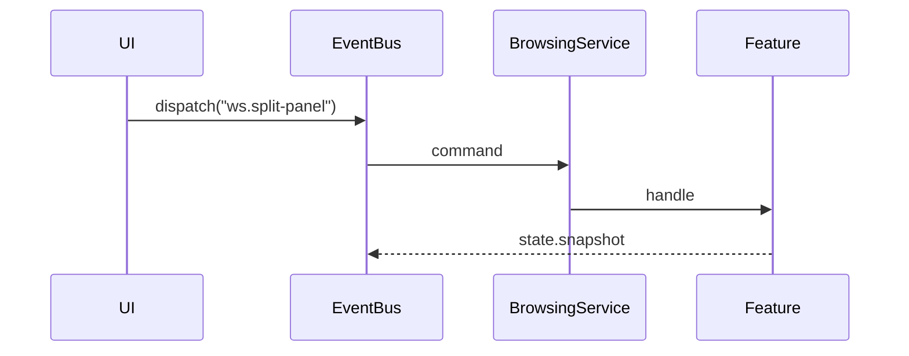

# ws.split-panel

**Group:** workspace
**Primary Key:** `(p) => p.panelId`
**Response:** void

## Payload

| Field | Type |
|-------|------|
| panelId | String |
| direction | Literal |
| newPanel | PanelRefSchema |

## Flow

