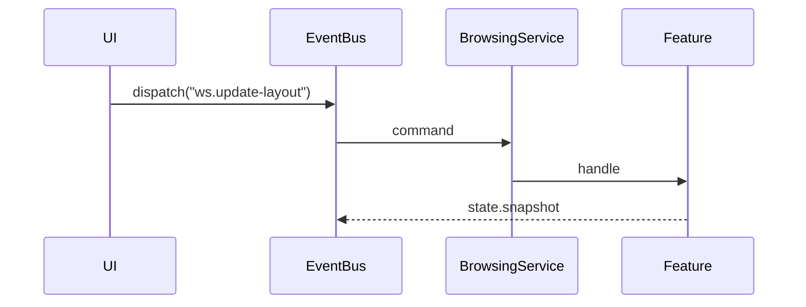

# ws.update-layout

**Group:** workspace
**Primary Key:** `() => "global"`
**Response:** void

## Payload

| Field | Type |
|-------|------|
| layout | Struct |
| version | Number |
| dockviewState | Unknown |

## Flow

