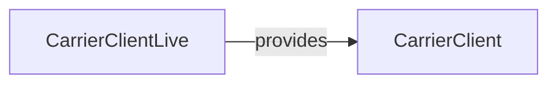

# CarrierClient

**Package:** `@ctrl/core.port.carrier`
**Tier:** core.port
**Tag ID:** CarrierClient
**Provided by:** —

## Methods

- `createClientProtocol`

## Dependencies

None

## Layer Graph

