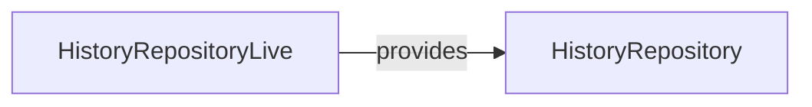

# HistoryRepository

**Package:** `@ctrl/core.port.storage`
**Tier:** core.port
**Tag ID:** HISTORY_REPOSITORY_ID
**Provided by:** HistoryRepositoryLive

## Methods

- `getAll`
- `record`
- `clear`

## Dependencies

None

## Layer Graph

