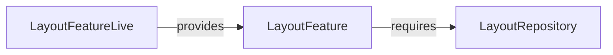

# LayoutFeature

**Package:** `@ctrl/domain.feature.layout`
**Tier:** domain.feature
**Tag ID:** LAYOUT_FEATURE
**Provided by:** LayoutFeatureLive

## Methods

- `getLayout`
- `getPersistedLayout`
- `updateLayout`
- `changes`

## Dependencies

- [[LayoutRepository]]

## Layer Graph

