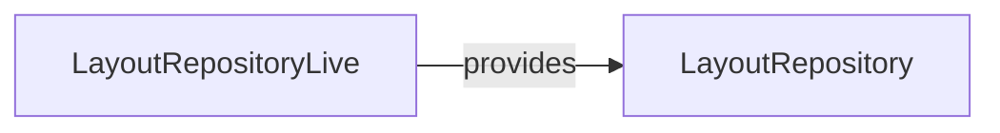

# LayoutRepository

**Package:** `@ctrl/core.port.storage`
**Tier:** core.port
**Tag ID:** LAYOUT_REPOSITORY_ID
**Provided by:** LayoutRepositoryLive

## Methods

- `getLayout`
- `saveLayout`

## Dependencies

None

## Layer Graph

