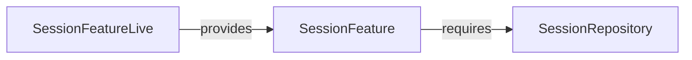

# SessionFeature

**Package:** `@ctrl/domain.feature.session`
**Tier:** domain.feature
**Tag ID:** SESSION_FEATURE
**Provided by:** SessionFeatureLive

## Methods

- `getAll`
- `create`
- `remove`
- `navigate`
- `goBack`
- `goForward`
- `setActive`
- `updateTitle`
- `updateUrl`
- `changes`

## Dependencies

- [[SessionRepository]]

## Layer Graph

