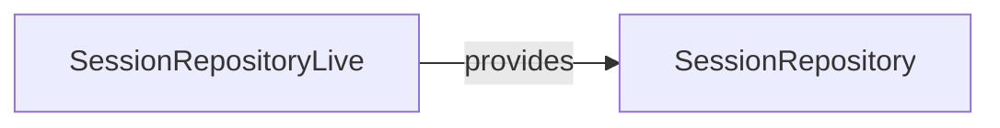

# SessionRepository

**Package:** `@ctrl/core.port.storage`
**Tier:** core.port
**Tag ID:** SESSION_REPOSITORY_ID
**Provided by:** SessionRepositoryLive

## Methods

- `getAll`
- `getById`
- `create`
- `remove`
- `setActive`
- `updateCurrentIndex`
- `addPage`
- `removePagesAfterIndex`
- `updatePageTitle`
- `updatePageUrl`

## Dependencies

None

## Layer Graph

